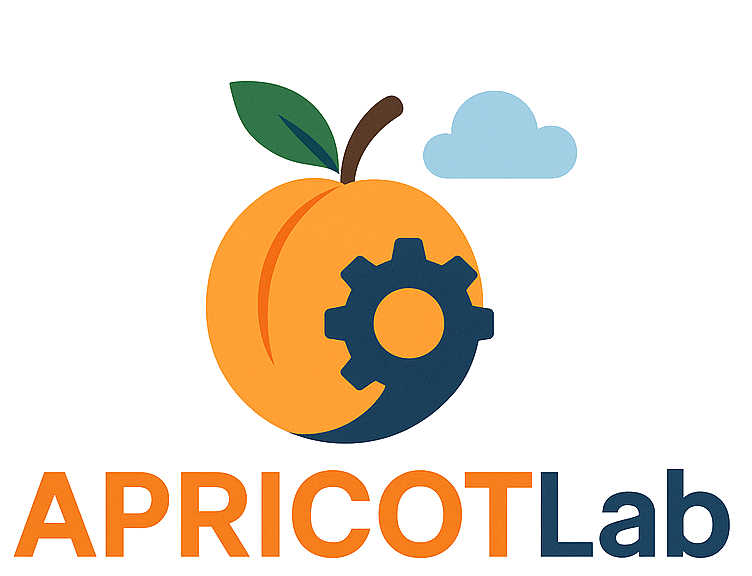

# APRICOTLab

[](https://github.com/grycap/apricotlab/actions/workflows/build.yml)
[](https://mybinder.org/v2/gh/grycap/apricotlab/main?urlpath=lab)



**APRICOTLab**: Advanced Platform for Reproducible Infrastructure in the Cloud via Open Tools for JupyterLab.

---

## 🌟 Introduction

**APRICOTLab** is an open-source JupyterLab extension that enables users to deploy, manage, and interact with multi-cloud infrastructures using a step-by-step graphical wizard and built-in IPython magics. It empowers reproducible research and experimentation in cloud-based environments using the familiar interface of Jupyter notebooks.

## 🔍 Features

- Deploy cloud infrastructures using a visual wizard or programmatically

- Support for multiple cloud providers like EGI, OpenStack or EC2

- Customizable infrastructure templates

- Integrated IPython magic commands for managing and interact with infrastructures directly from notebooks

- Seamless command execution, file upload/download, and monitoring

- Create reproducible computational experiments

## 🧬 Experiment Replication Methodology

**APRICOTLab** enables reproducible experiments that require complex infrastructure by:

- Providing a set of predefined, configurable infrastructures that can be redeployed by other researchers using the same configuration.

- Allowing command execution on deployed infrastructures directly from the notebook, making it easy to document and install additional software during an experiment.

- Leveraging the Jupyter environment for full documentation of experiments with text, live code, and visual outputs.

## ⚙️ Requirements

A [Jupyter](https://jupyter.org/install) environment (compatible with JupyterLab ≥ 4.0.0).

The [Infrastructure Manager (IM)](https://imdocs.readthedocs.io/en/devel/gstarted.html) client must be installed and configured, an open-source virtual infrastructure provisioning tool for multi-Clouds.

## ✨ IPython Magics for Infrastructure Management

The extension provides a set of custom IPython magic commands for interacting with deployed infrastructures:

To use the magics, load them in your notebook:

```python
%reload_ext apricot_magics
```

You can also configure Jupyter to load them automatically.

### Line magics

- `%apricot_token [refresh_token]`:
  Generates a new access token using the provided `refresh_token`.
  If no `refresh_token` is supplied, a previously saved token will be used instead.

- `%apricot_ls`:
  Lists all deployed infrastructures.

- `%apricot_log <infra_id>`:
  Shows the deployment logs of the specified infrastructure.

- `%apricot_info <infra_id>`:
  Returns the specifications of the given infrastructure.

<!-- - `%apricot_vmls <infra_id>`:
Lists the virtual machines and their status of a given infrastructure. -->

- `%apricot_upload <infra_id> <local_paths> <dest_path>`:
  Uploads local files to the specified infrastructure.

- `%apricot_download <infra_id> <remote_paths> <local_dest>`:
  Downloads files from the infrastructure to the local system.

- `destroy <infra_id>`:
  Destroys the specified infrastructure.

### Line and cell magic

- `%%apricot` (or `%apricot`):
  Supports subcommands such as:

- `exec <infra_id> <command>`: Executes a shell command in the specified infrastructure.

- `list`: Alias for `%apricot_ls`.

- `destroy <infra_id>`: Destroys the specified infrastructure.

## 🐳 Docker

A `Dockerfile` is provided for easy setup:

```bash
docker build -t apricotlab .
docker run --publish 8888:8888 apricotlab
```

This will launch a JupyterLab instance with APRICOT pre-installed.

## 🛠 Development Installation

> Note: Node.js is required for building the extension.
> Note: The `jlpm` command is JupyterLab's pinned version of [yarn](https://yarnpkg.com/) that is installed with JupyterLab.

```bash
# Clone the repository
git clone https://github.com/grycap/apricotlab.git
cd apricotlab

# Install the Python package in development mode
pip install -e .

# Link the extension to JupyterLab
jupyter labextension develop . --overwrite

# Build the extension
jlpm build
```

You can run the extension in watch mode:

```bash
# Terminal 1: Watch the source directory, automatically rebuilding when needed
jlpm watch

# Terminal 2: Run JupyterLab
jupyter lab
```

To ensure source maps for easier debugging:

```bash
jupyter lab build --minimize=False
```

## 🧹 Uninstall (Development)

```bash
pip uninstall apricot
```

You should also remove the symlink created with `jupyter labextension develop`. Run:

```bash
jupyter labextension list
```

...to find the `labextensions` folder and manually remove the `apricot` symlink.

## 📦 Packaging the Extension

For packaging and releasing, see [RELEASE.md](RELEASE.md).

## 🛡️ License

Distributed under the BSD 3-Clause License.
